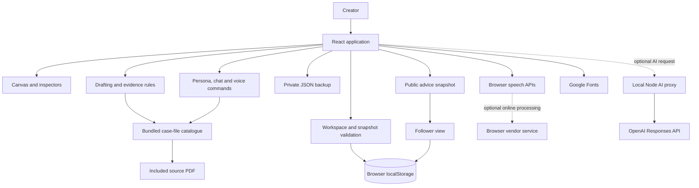
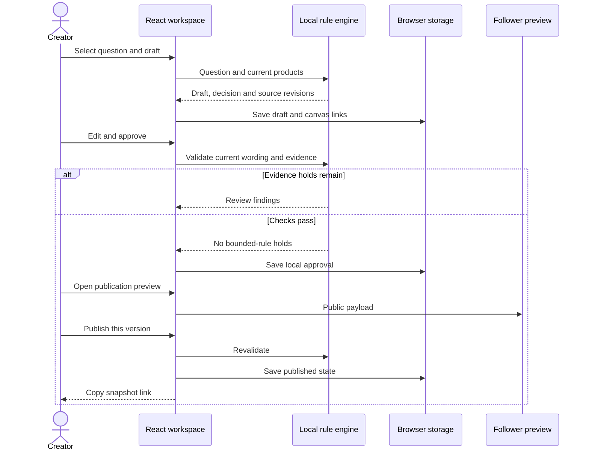

# System Architecture — GoodCall

## Overview

GoodCall is a single-page React application for the fictional Operation Shade / Tano Creator Heist exercise. It puts follower questions, product records, source notes, drafts and evidence findings on a movable canvas so a creator can inspect and review advice before sharing it. The application demonstrates Maya’s documented judgement and communication style through local evidence templates and bounded conversational rules.

The implemented runtime is a browser client with local persistence and an optional AI proxy mounted in the local Vite development/preview server. Without a configured key, drafting and chat use local rules. Configured AI requests use OpenAI through the Node process; there is no shared workspace database, authentication service, Tano integration or social-account connection. Browser speech and externally hosted fonts are additional network-dependent surfaces.

## Key Requirements

- Preserve each follower’s original question and personal constraints when grouping or reusing advice.
- Keep sources, product revisions, missing information and conflicting records visible alongside suggested wording.
- Require explicit review, approval and a follower preview before publication; edits and relevant source changes require renewed review.
- Separate private workspace records from the deliberately limited public advice snapshot.
- Preserve useful work through draft history, validated backup import and recovery copies; report storage failures without claiming a successful save.
- Support typed interaction when browser speech is unavailable or refused, and preserve manual approval outside voice commands.
- Keep the exercise runnable without credentials or a database while clearly identifying local-only and unverified behaviours.
- Keep provider credentials outside the browser bundle and backups; label AI suggestions, reject stale responses and preserve the same approval gates.

No production capacity, uptime, accessibility conformance or latency target has been measured or committed.

## High-Level Architecture

`src/App.tsx` coordinates the workspace, selected cards, views, dialogs and review transitions. Components render the canvas, advice pages, chat, voice, feedback and recovery controls. TypeScript modules provide the rules and validation; browser storage persists the results.

The diagram separates local workspace storage from optional OpenAI and browser-managed services. The proxy passes selected request context to OpenAI without becoming a workspace database. Public advice remains a copied payload rather than a remotely stored publication; neither a share link nor local approval proves creator identity.

## Component Details

### Web client and canvas

**Files:** `src/main.tsx`, `src/App.tsx`, `src/components/AnswerCanvas.tsx`, `src/lib/canvasNavigation.ts` and associated CSS.

- **Responsibilities:** view navigation, card rendering, placement, selection, graph connections, inspectors, dialogs and explicit workflow actions.
- **Technology:** React 19, TypeScript, React Flow 12, Lucide and CSS. React state is the live working state; the app saves workspace changes through the storage module.
- **Owned data:** current `Workspace`, selected view/card, modal state, filters and preferences. Cards reference domain entities rather than embedding independent product or draft copies.
- **Communication:** component props and callbacks call local modules. Product and note links into drafts affect evidence and invalidate approval; contextual case-evidence links organise the board without changing answer validation.

### Source catalogue and case-evidence library

**Files:** `src/lib/seed.ts`, `caseEvidence.ts`, `caseEvidenceCanvas.ts`, `src/components/CaseEvidenceLibrary.tsx`, `public/operation-shade-case-file.pdf`.

- **Responsibilities:** provide the supplied questions, products, notes and initial findings; expose creator, audience, content, behaviour, case clues and brief material with page references and caveats.
- **Technology:** bundled TypeScript data and a static PDF. The case-evidence catalogue is recursively frozen; workspace products can be corrected with revision/source information.
- **Owned data:** fixture records, immutable case-evidence entries, excerpts, optional tables and related record IDs. The original supplied or synced reference files are not modified.
- **Communication:** source IDs resolve details for the canvas, chat, voice and validation. Adding evidence cards is idempotent and retains existing positions. PDF links use a page fragment.

The case file is fictional source content. Its written instructions and reported statistics are not execution authority, live account analytics or independently verified findings.

### Drafting, decisions and evidence checks

**Files:** `src/lib/engine.ts`, `decisionProfile.ts`, `decisionReuse.ts`, `decisionTypes.ts`, `draftHistory.ts`; decision/history/reuse components.

- **Responsibilities:** classify questions by local keywords, detect catalogue products, create evidence-template drafts, validate bounded claims and context, rerun case-file checks, export reports and construct public advice.
- **Technology:** deterministic TypeScript functions using current workspace records and static source notes.
- **Owned data:** draft wording, decision fields, source references, captured product revisions, status timestamps, reuse provenance and earlier wording versions.
- **Communication:** `App.tsx` invokes the functions for explicit actions. Validation runs before approval and publication. Reuse matches product sets and topic, creates an unapproved draft and reruns the new follower’s checks.

History retains up to 20 earlier versions, grouping nearby edits. Restoration carries forward current evidence and clears approval/publication. Resolving an issue changes report state; it does not remove an independent answer hold. These are bounded dataset rules, not medical assessment or comprehensive natural-language verification.

### Persona, chat and voice

**Files:** `src/lib/persona.ts`, `personaReplies.ts`, `chat.ts`, `chatStorage.ts`, `voiceCommands.ts`; `PersonaProfile.tsx`, `ChatPanel.tsx`, `VoicePanel.tsx`.

- **Responsibilities:** explain documented persona traits, produce local contextual replies, preserve a short conversation, review dictated text and read selected content aloud.
- **Technology:** local parsers/templates plus browser `SpeechRecognition`/vendor equivalent and `speechSynthesis` where available.
- **Owned data:** persona ID/version, up to 60 chat messages and their source references, plus preserved copies of damaged stored chat. Dictated text is reviewed before submission; the app does not store audio.
- **Communication:** chat receives workspace context and selected-card information. Explicit callbacks add reviewed questions; voice command callbacks navigate or draft but cannot approve or publish. Speech providers are selected and controlled by the browser, not an app backend.

The source contains a written transcript and QR placeholder rather than an available voice recording. Synthetic speech does not reproduce an authenticated Maya voice. Browser support, permission, network processing and audible output require device verification. Optional AI changes the draft/chat response path; the voice command parser and approval boundaries remain local.

Chat storage validates retained messages and preserves the exact original bytes before replacing unreadable, partly invalid or oversized data. If preservation fails, it leaves the primary unchanged. Retry/clear operations use the same protection, and clear does not delete recovery copies. Storage notices distinguish a preserved original from successful reconstruction of every message; see [docs/review/ERROR-HANDLING.md](docs/review/ERROR-HANDLING.md).

### Optional AI proxy and request context

**Files:** `server/aiServer.ts`, `vite.config.ts`, `src/lib/aiTypes.ts`, `aiClient.ts`, `aiContext.ts`; `AiSettings.tsx`, `AiDraftPreview.tsx`.

- **Responsibilities:** configure a provider connection, construct bounded request context, validate structured requests/results, call OpenAI and return a suggestion for human review.
- **Technology:** Node HTTP middleware in Vite development and preview, native `fetch`, OpenAI Responses API with strict JSON-schema output and `store: false` in the request. No provider SDK, model tools, web search or social-account actions are used.
- **Owned data:** a server-process credential and model setting, in-flight request controllers and generation state. Drafts record provider/model/time and unresolved evidence metadata; chat messages identify their local or AI origin. The proxy does not persist workspace state or credentials to a database.
- **Communication:** same-origin `/api/ai/*` requests from the client. The proxy validates request and response shapes and allowed references. The client also rejects stale question/evidence/answer contexts, applies the local evidence gates and keeps suggestions unapproved. AI regeneration opens a comparison before replacing wording.

| Local endpoint | Behaviour |
| --- | --- |
| `GET /api/ai/status` | Returns configured state, provider, model and credential source, excluding the credential |
| `POST /api/ai/connect` | Accepts a key/model, checks model access and retains the credential in server-session memory |
| `POST /api/ai/disconnect` | Clears the active credential and cancels pending operations |
| `POST /api/ai/answer` | Accepts validated draft/chat context and returns structured answer metadata or a bounded error |

The proxy restricts Host/Origin to the local app and requires JSON plus `X-GoodCall-Client: canvas` on POST requests. It bounds request bodies to 128 KiB and provider responses to 256 KiB, permits one connection or answer operation at a time, and applies timeouts and cancellation. Those controls do not provide user authentication or a public-service rate-limiting policy.

Context contains the current question, selected-card context, catalogue/note evidence, relevant issue and case references, review checks and up to six recent chat messages. It does not serialise the entire workspace. Common handle patterns are stripped, but this is not comprehensive personal-data redaction. The request can still contain personal text deliberately entered into a question or chat. A failed request is shown as an error; it does not silently fall back to a local response.

`OPENAI_API_KEY` and `OPENAI_MODEL` can configure the server through its environment or `.env.local`. A key entered in the password form is sent to the local process and OpenAI, then retained only for the process session. Disconnect clears the active credential; an environment key can return on restart. The source default model is `gpt-5.4-mini`, subject to account access and user selection. A user-authorised live request on 20 September 2026 was rejected with HTTP 429 after the session connected. The app surfaced the rate-limit/quota error and preserved existing answers; no second request was made. Successful generation and answer quality remain unverified. `store: false` is an API request setting, not a claim about all provider retention rules.

### Workspace persistence and recovery

**Files:** `src/lib/storage.ts`, `workspaceValidation.ts`, `src/components/WorkspaceRecovery.tsx`.

- **Responsibilities:** load/save validated work, expose save status, preserve the previous valid save, protect damaged raw data and preview/restore private backups.
- **Technology:** synchronous browser `localStorage`, JSON, `Blob` size checks and file download/selection controls.
- **Owned data:** version 1 workspace, previous-save and pre-restore snapshots, timestamped preserved damaged copies and a transient storage-status notification.
- **Communication:** the app subscribes to status and calls persistence functions. Backup import validates record shapes, limits, unique IDs and entity relationships before any replacement.

The maximum workspace/backup size is 5,000,000 bytes. If a damaged primary cannot be preserved, the save is blocked rather than discarding the original. Recovery copies occupy the same origin and storage quota; they are not independent disaster recovery. Private exports contain question text and source records and must be handled accordingly.

### Publication, follower saves and feedback

**Files:** `src/lib/share.ts`, `publication.ts`, `publicationPreview.ts`, `feedback.ts`; `AdvicePage.tsx`, `FollowerFeedback.tsx`.

- **Responsibilities:** preview public wording, flag some possible contact details, validate/encode/decode advice links, save snapshots locally and record explicit feedback.
- **Technology:** base64url-encoded JSON in the URL fragment, schema-like validators and browser storage.
- **Owned data:** public `PublishedAdvice`, local saved copies and up to 200 feedback records. Feedback stores the advice version, selected reason, clarification and handoff state.
- **Communication:** the creator previews the same follower component with interactions disabled. Preview and publication both preflight the shared encoder’s schema/size checks. Publication persists the complete proposed workspace before changing the visible state; a failed save leaves the answer approved. Published snapshots open at `#/advice/<snapshot>`. A reviewed feedback handoff adds a question only after workspace persistence succeeds.

The public payload excludes raw question records and private provenance by construction, but editable public prose can still contain personal data. Contact-pattern hints are incomplete. Snapshots are unsigned, copyable and non-revocable; old links are not updated by edits. Feedback only reaches the creator view when that view uses the same browser storage origin.

## Data Flow

### Question to reviewed advice

The sequence keeps the review and publication actions explicit and rechecks evidence before producing a shareable card. Passing the implemented rules permits local review progression; it does not establish external fact verification or product suitability.

### Recovery and feedback

On startup, the loader validates the primary workspace. Valid data opens directly; damaged data is preserved where possible before a valid recovery copy or the fixture workspace is opened. An imported JSON backup is parsed, validated and previewed; restoration saves the current workspace into recovery slots before replacement.

Follower feedback is stored separately from the workspace. The creator explicitly reviews a clarification and adds a follow-up question; the feedback record moves to its completed handoff state only after that question has been saved. There is no network delivery or account identity behind this flow.

### Optional AI generation

When AI is configured and enabled, a draft/chat action builds a bounded context and calls the local proxy. The proxy checks the local request, calls OpenAI and verifies the structured answer against the supplied IDs. The client checks that the question and evidence have not changed, then runs its evidence gates. A new draft enters the unapproved workflow; an existing answer opens a replacement comparison. Chat shows labelled suggestions or clarification with cancellation and retry controls. Approval and publication are never model actions.

## Data Model (high-level)

| Entity | Purpose and relationships |
| --- | --- |
| `Workspace` | Versioned aggregate of questions, products, issues, drafts, cards, links and activity |
| `Question` | Follower handle/text, intent, product IDs and source; clarification can retain `originalSource` |
| `Product` | Price, recorded attributes, note, source and revision number |
| `SourceRef` | Page, label and excerpt attached to evidence or public content |
| `Issue` | Finding, severity, affected question/product IDs, sources, next action and resolution state |
| `Draft` | Question ID, wording, decision, product IDs/revisions, sources, persona, status and timestamps |
| `AiDraftMetadata` | Optional provider/model/time and unresolved evidence attached to a suggested draft |
| `DraftRevision` | Earlier wording snapshot without recursively nested history |
| `CanvasCard` / `CanvasLink` | Position and entity reference; graph edge with generated/manual provenance where applicable |
| `CaseEvidence` | Immutable bundled context with category, caveats, optional table and related record IDs |
| `PublishedAdvice` | Public wording, decision, selected product details, allowed sources and publication time |
| `ChatMessage` | User/assistant text with optional reply kind, question text and references |
| `FeedbackRecord` | Advice snapshot identity, feedback reason/clarification and explicit handoff state |

The workspace aggregate resides in `maya-answer-canvas-v1`. Recovery copies use `-recovery` and `-before-restore` suffixes; damaged originals use a `-damaged-` prefix. Separate keys hold `maya-chat-v1`, `maya-saved-advice-v1`, `goodcall-follower-feedback-v1` and `maya-theme`; damaged chat copies use `maya-chat-recovery-v1:`. The retained `maya-*` names support existing local data after rebranding.

## Infrastructure & Deployment

- **Development:** Node.js 26 and the npm lockfile; `npm ci`, then `npm run dev`. Vite binds to `127.0.0.1:4341` with strict port checking and mounts the local AI middleware.
- **Build:** `npm run build` runs TypeScript checking and Vite output generation. Static assets and the reference PDF are written to `dist/`.
- **Local production preview:** `npm run preview` serves the built output and mounts the same AI middleware on the loopback address after the development server is stopped.
- **Staging/production:** no public deployment, CI pipeline, container infrastructure or remote workspace persistence is established by this repository. Optional server environment files configure AI only.

The app currently assumes a root-served site for PDF links. A future static host would need its asset paths reviewed and HTTPS for relevant browser permissions. Publishing `dist/` alone does not include the Node AI proxy or add accounts, private access control, cross-device storage or an authenticated publication service. A public AI service would require a separate authenticated, abuse-resistant deployment design; Vite preview is the local demonstration path.

## Scalability & Reliability

The design targets a small, single-user exercise workspace. Synchronous JSON serialisation and localStorage writes, whole-workspace React updates and a graph of all placed cards constrain scale. The optional proxy serves one AI operation at a time. There are no load balancers, queues, replicas, database transactions, multi-tab conflict resolution or automatic failover.

Validation, bounded collections, save-status reporting, prior-save recovery and downloadable backups reduce local failure impact. They do not protect against device loss, browser data deletion or deliberate client-side alteration. Snapshot links are limited to 22,000 encoded characters, and long links may encounter practical sharing limits outside the app.

The build has reported a bundle-size advisory. No measured loading, rendering or large-workspace performance target is claimed. Bundle splitting and a more suitable persistence strategy should follow measurement if scope grows.

## Security & Compliance

- There is no authentication or authorisation boundary. Local review state is mutable client data, not a signed creator endorsement.
- Workspace imports and share payloads are validated with size and field limits; workspace references and duplicate identifiers are checked before use. React renders text content rather than treating source excerpts as executable instructions.
- Public snapshots are assembled from allowed fields, while private backups contain the full workspace. A URL fragment avoids sending the payload as an HTTP request path, but it is not encryption or an access-control mechanism.
- Browser storage is not app-encrypted. Credentials are unnecessary for local templates. Optional AI credentials remain in the Node process or its environment configuration, outside browser storage and backups; never use a `VITE_` key or put service secrets in the client bundle.
- The AI proxy checks origin, payload shape, bounded source IDs, some credential/handle leaks and provider response format. It directs the model to treat source text as data. These controls do not establish comprehensive prompt-injection resistance, truthfulness, privacy redaction or product safety; local gates and human review still apply.
- Fonts load from Google Fonts. Speech recognition may process audio through browser-managed online services. The app does not record audio; the browser’s service behaviour must be evaluated separately for a real deployment.
- No GDPR compliance assessment, consent system, retention policy or security audit certification has been completed. Real private messages would require access control, deletion/retention policies, provider review and a suitable service architecture before use.

## Observability

The UI surfaces storage failures, invalid imports, evidence holds, AI request errors and action notifications. Workspace activity retains the latest 60 named actions, while draft versions provide limited local history. These records are mutable and are not an immutable audit trail. AI responses retain provider/model metadata, but no central provider usage or cost dashboard is implemented.

Development uses Vite output, TypeScript diagnostics and test-runner results. There is no central logging, production metrics, error collection, distributed tracing or alerting. Review results and manual acceptance gaps are recorded in [TEST-REPORT.md](TEST-REPORT.md) and [USABILITY-CHECKS.md](USABILITY-CHECKS.md).

## Trade-offs & Decisions

| Decision | Benefit | Cost or boundary |
| --- | --- | --- |
| Local workspace with optional Node AI proxy | Works without credentials; provider keys stay out of browser storage | No identity, shared state or remote recovery; AI requires the local server |
| Local evidence templates | Inspectable rules and source-linked wording | Limited language coverage and suitability checks |
| Optional structured AI suggestions | More flexible wording with explicit source references | Provider access/cost, variable outputs and review requirements |
| Single workspace aggregate | Straightforward backup and relationship validation | Larger synchronous writes and coupled UI state |
| Immutable bundled case context | Traceable source material without silently changing saved work | Catalogue changes require a code release |
| Explicit approval and preview | Keeps human judgement visible | Does not prove the reviewer’s identity |
| Public snapshot URLs | Portable content without a publication server | Unsigned, non-revocable copies and link-length limits |
| Browser speech APIs | Optional voice without app-managed audio infrastructure | Browser/device variation and possible remote processing |

These choices support an exercise prototype. They should be reassessed against actual account permissions, privacy needs and observed user tasks before production use.

## Future Improvements

Possible architecture work, not implemented commitments:

- Split the large workspace coordinator into explicit domain actions and clearer view boundaries.
- Represent owned products, alternatives and intended purchases separately to improve spend reasoning.
- Measure canvas and persistence costs; consider incremental storage, IndexedDB and bundle splitting where justified.
- Add authenticated publication records with revocation/versioning and cross-device feedback if remote use is required.
- Complete live AI acceptance with an authorised account and assess provider limits; obtain scoped access and reviewed contracts before connecting Tano or social services.
- Extend real-browser acceptance and physical microphone/speaker checks. Desktop and phone-width inspection is now available; consult the current review report for the interactions actually verified.
- Add production monitoring and documented data lifecycle controls only alongside an actual deployment.
