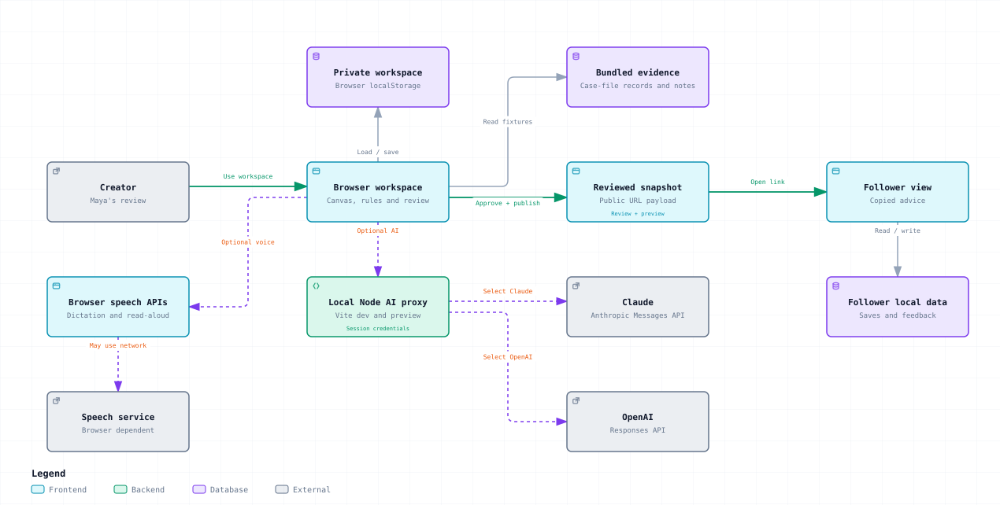

# GoodCall

A canvas where creators can draft, review and reuse advice based on their own judgement.

Watch the 60-second walkthrough below, and use the player's sound control to hear the narration.

https://github.com/user-attachments/assets/afcde62e-0aca-45eb-bc52-dd00cbdfee06

[Open the video](https://github.com/user-attachments/assets/afcde62e-0aca-45eb-bc52-dd00cbdfee06) · [Download MP4](https://github.com/MasteraSnackin/GoodCall/raw/refs/heads/main/docs/demo/GoodCall-60-Second-Demo.mp4) · [Download the interactive walkthrough](https://github.com/MasteraSnackin/GoodCall/raw/refs/heads/main/docs/demo/GoodCall-interactive-walkthrough.zip)

Saved app screens, guided highlights and British English narration explain how Maya uses the workspace.

## Description

GoodCall is a working local prototype for the fictional Operation Shade / Tano Creator Heist exercise. Maya organises follower questions on a movable canvas, links them to evidence and drafts answers in her own style. Each question stays with its sources, decision and review status, so she can check for missing or conflicting information before sharing an advice card.

The app stores work in the browser and uses local rules for the exercise data. It works without credentials. You can also configure and enable Claude or OpenAI for drafts and chat through a local Node proxy. Every answer needs review. Tano and social inboxes are not connected. Optional browser speech may use the browser vendor's online services.

## Table of contents

- [Description](#description)
- [Features](#features)
- [Tech stack](#tech-stack)
- [Architecture overview](#architecture-overview)
- [Installation](#installation)
- [Usage](#usage)
- [Configuration](#configuration)
- [Screenshots / demo](#screenshots--demo)
- [API / CLI reference](#api--cli-reference)
- [Tests](#tests)
- [Roadmap](#roadmap)
- [Contributing](#contributing)
- [License](#license)
- [Contact / support](#contact--support)

## Features

- Move question, product, note, answer, issue and case-evidence cards around the canvas. The app saves their positions and connections. Search for cards, focus their connections, zoom, use the minimap or expand the view.
- Search the case-file library for creator context, audience profiles, content, behaviour, missing materials and the exercise brief. Page references, tables and caveats distinguish reported figures from verified findings. Add context cards without changing existing work. Linking a card does not validate an answer.
- Work with the 12 supplied questions, 10 products and four note/transcript summaries, or review and add typed or dictated questions. Keyword grouping keeps each original question intact. Clarifications retain their original source.
- Edit answers built from evidence templates in Maya's documented style. The app checks for missing records, stale product revisions, budget or context conflicts, unsupported claims and changes to known prices or quotations. The checks distinguish explicitly owned products, alternatives and new purchases. Unclear roles or quantities need clarification. Approval and publication are separate actions.
- Record Maya's decision, who the answer suits, when to skip and what remains unknown. Search reviewed advice and reuse an answer that matches the product or topic as a new, unapproved draft. See [DECISIONS.md](DECISIONS.md).
- Compare refreshed wording, keep edits or restore up to 20 earlier draft versions. Restored drafts use current evidence and need fresh approval. Export, validate, preview and restore private workspace backups while keeping recovery copies.
- Review ten case-file checks, each with source excerpts, affected records, next actions and resolution references. Export the findings as a Markdown report. Resolving a report does not bypass answer validation.
- Preview exactly what followers will see before publishing, then save or share an encoded snapshot. The generated snapshot excludes raw question records and private workspace provenance. After explicit review, feedback can become a follow-up question. Feedback stays in the same browser and on the same origin.
- Type in chat, review dictation, use supported navigation and drafting commands, or hear replies read aloud in a synthetic voice. Commands cannot approve or publish. Adding a question from chat is an explicit action; chat does not silently change the workspace.
- Choose optional Claude or OpenAI assistance for draft suggestions and chat with source references. Suggestions leave existing answers unchanged until you apply them. Local evidence checks, stale-response checks and human approval still apply.
- Use Maya's documented traits and examples for drafts and voice replies. Choose the Warm studio, Beauty editorial or Case-file desk theme. See [PERSONA.md](PERSONA.md).

The checks cover this exercise dataset. They cannot audit arbitrary uploaded documents, establish product safety or verify every claim for factual accuracy. This is a single-user prototype without authentication, a shared database or an immutable audit log.

## Tech stack

| Area | Technology |
| --- | --- |
| Interface | React 19, TypeScript 5.9, CSS, Lucide icons |
| Canvas | React Flow 12 (`@xyflow/react`) |
| Local development and build | Vite 7, Node.js 26, npm lockfile |
| Application logic | Local TypeScript rules, evidence templates and source fixtures |
| Optional AI | Node middleware in the local Vite server; Anthropic Messages API or OpenAI Responses API |
| Persistence | Browser `localStorage`, JSON backup files, URL snapshot payloads |
| Voice | Browser speech recognition and speech synthesis, where supported |
| Tests | Node test runner via `tsx`; Vitest, Testing Library and jsdom |

## Architecture overview

[](docs/diagrams/system-overview.preview.svg)

[Download the interactive maps](docs/diagrams/GoodCall-diagrams.zip) · [Editable source](docs/diagrams/system-overview.architecture.json) · [Diagram guide and checks](docs/diagrams/README.md)

The main path shows how a creator reviews and publishes advice, then how a follower sees it. Branches show local evidence and storage, plus optional AI and speech services. Click the preview to enlarge it, or extract the download and open `index.html` to explore the maps.

The React app manages the workspace and runs local rules for drafting, evidence checks and changes in review status. Browser storage holds private work and local follower data. Share links contain validated public snapshots. The optional local Node proxy holds AI credentials and calls the selected provider; it has no accounts or remote workspace database. See [ARCHITECTURE.md](ARCHITECTURE.md).

## Installation

Use Node.js 26. The initial release was tested with Node 26.8.1 and npm 11.19.0. The repository includes an `.nvmrc` for `nvm` users.

1. Clone the repository and enter it:

   ```sh
   git clone https://github.com/MasteraSnackin/GoodCall.git
   cd GoodCall
   ```

2. Select Node 26 if using `nvm`, then install the locked dependencies:

   ```sh
   nvm install
   nvm use
   npm ci
   ```

3. Start the app:

   ```sh
   npm run dev
   ```

Open http://127.0.0.1:4341/. Use the same address each time: `localhost` and `127.0.0.1` have separate browser storage. You do not need a database, API key or external account.

## Usage

### First demo

1. Choose **Demo guide → Start the demo**, or **Draft answer** on Sarah’s Cloud Cream question.
2. Inspect the question, product evidence and suggested wording. The case-file price is £38.
3. Choose **Approve answer**, then **Publish advice card**. Inspect the follower preview and choose **Publish this version**.
4. Choose **Share approved answer → Open follower view**. Save the answer or copy its link.
5. Return to the workspace and draft Jessica’s Barrier Cream answer. Its missing product information prevents approval.
6. Open **Evidence & issues**, inspect the Barrier Cream finding and choose **Export report**.

### Navigate and expand the evidence

Use **Find a card** to search the board. **Focus connections** shows the cards connected to your selection. **Show all cards** or **Fit** restores the view without changing saved positions. The bottom controls let you zoom, return to **100%**, fit the board, focus a selected card and pan with the minimap. Choose **Expand canvas** for more space. Close details with **Escape** or the close button, and reopen them with **Show card details**.

Use the editing toolbar to select and move several cards, align or space them, lock positions, and add review notes. **Undo** and **Redo** apply to layout changes; answers and approvals stay intact. Notes save with the workspace but are excluded from AI requests and published advice. On phones, scroll the toolbar sideways to reach every tool. See the [canvas tools guide](docs/CANVAS-TOOLS.md) for shortcuts and history limits.

Choose **Case evidence** on the canvas to open the **Case-file evidence** library. Search the sources, then add individual cards or an overview. Source links open the included PDF at the relevant page. The cards describe the fictional file, including its uncertainties. They do not show live account analytics.

### Chat, voice and persona

Open **Chat with Maya** and try “Is Cloud Cream worth £38?”, followed by “My budget is £30”, or ask “What’s missing?”. Use **Enter** to send and **Shift + Enter** for a new line. You can edit dictation until you choose to send it. **Read aloud** speaks one reply; **Speak replies** applies to new replies.

The latest 60 messages stay on this device until you clear them. The app copies damaged chat data before replacing it. If it cannot make the copy, it stops the write and offers a retry. Clearing active history leaves recovery copies intact.

In **Voice**, review the transcript before choosing **Run command** or **Use as question**. Try “Show reports”, “Explain this card”, “What is your approach?” or “Draft an answer for Sarah”. A drafting command that names a follower needs an exact match. The browser voice is synthetic. The source PDF contains a transcript and QR placeholder but no usable recording of Maya. The app stores no audio.

### Optional live AI

Choose **Set up AI** in the header. Select **Claude (Anthropic)**, enter an Anthropic API key and choose **Connect and enable AI**. Claude Haiku 4.5 (`claude-haiku-4-5-20251001`) is the default for a fresh connection. OpenAI remains available as an alternative with its own API key. An OpenAI key cannot connect to Claude.

Connecting tests whether your account can access the selected model, but does not establish whether it can generate an answer. Once connected, you can change models without re-entering the key. Switching providers requires the new provider's key. The app keeps the existing connection until the new check succeeds. **Use live AI for new answers and chat** controls whether new requests use the provider or local templates.

Live requests use your API account and send the current question, supporting catalogue and case-file records, selected context and a short chat history to the selected provider. The app removes common follower-handle patterns, but other personal data may remain. Review what you enter.

On 20 September 2026, a live OpenAI request returned HTTP 429 without saving or overwriting an answer. A later Claude check produced a sourced clarification draft that remained unapproved. Context and wording checks held two chat responses; [TEST-REPORT.md](TEST-REPORT.md) records the fixes and acceptance status. One successful draft does not establish general answer quality.

For an existing answer, **Suggest with AI** opens a comparison so you can review the wording before replacing it. Applying a suggestion returns the answer to draft. Failed or cancelled requests leave the current wording intact. The app does not silently switch providers or substitute a local answer. It shows provider errors without exposing private response details. Disconnecting clears the active server credential and cancels pending requests. Configuration from environment variables can return after a server restart.

The server holds keys entered in the form for the current session and clears them on restart. The app does not automatically save these keys to disk or browser storage. Use the server environment variables below to keep your local configuration across restarts.

### Protect work and review publication

**Regenerate from evidence** compares the existing wording with a fresh suggestion. You can keep your wording and refresh the evidence, or accept the suggestion. Either choice needs review. **Saved draft versions** restores wording with current evidence; it does not restore an old approval.

Use **Backup & restore** to download a private JSON backup or preview a replacement. Backups include workspace questions, evidence records, drafts, history, reports and layout. Chat, follower saves, feedback and appearance preferences are stored separately.

The publication preview flags some possible contact details, but you need to check the full wording before making it public. Preview and publication use the same checks for snapshot format and size. Published advice becomes visible only after the app successfully saves the proposed workspace.

Followers can choose **That helped**, **Too expensive**, **I already own something similar** or **Still unsure**. Review a clarification in **Follower feedback** before adding it as a question. The prototype does not send feedback between devices or message a follower.

### Build and preview

```sh
npm run build
npm run preview
```

Stop the development server before previewing. Both use port 4341 with strict port checking. `build` writes `dist/`. The included servers bind to the local machine; they do not deploy the app to the internet. A shared snapshot only opens on a device that can access the app's origin. Editing or withdrawing the original does not revoke an existing link.

## Configuration

Local templates need no environment variables. The optional proxy accepts `AI_PROVIDER=anthropic` with `ANTHROPIC_API_KEY` and `ANTHROPIC_MODEL`, or `AI_PROVIDER=openai` with `OPENAI_API_KEY` and `OPENAI_MODEL`. The model defaults are `claude-haiku-4-5-20251001` and `gpt-4.1-mini` respectively. Check both model access and whether your account can generate a response.

Use the server environment or a private `.env.local` file. The repository ignores populated environment files and includes a blank `.env.example`. Restrict access to any populated file to your user account. Never prefix a key with `VITE_`, place it in client source or commit it. Each provider receives only its own credential.

If you do not select a provider, an Anthropic environment key takes precedence. Existing OpenAI-only configurations still work. An unconfigured app defaults to Claude.

You can also enter a key through **AI connection** for the current session. The local server process holds the key; it is not included in browser storage or workspace backups. The proxy runs in both `npm run dev` and `npm run preview`. A static `dist/` deployment does not contain it.

| Setting | Location | Behaviour |
| --- | --- | --- |
| Node version | `.nvmrc` | Node 26 development baseline |
| Server address | `package.json` scripts | `127.0.0.1:4341`, strict port |
| AI provider | `AI_PROVIDER` | `anthropic` or `openai`; fresh setup defaults to Claude |
| Claude key/model | `ANTHROPIC_API_KEY`, `ANTHROPIC_MODEL` | Server-only Claude configuration |
| OpenAI key/model | `OPENAI_API_KEY`, `OPENAI_MODEL` | Server-only alternative; no key required for local mode |
| Build | `vite.config.ts`, `tsconfig.json` | React plugin and strict TypeScript checking |
| UI tests | `vitest.config.ts` | jsdom, `tests/**/*.test.tsx`, shared setup |
| Main workspace | `maya-answer-canvas-v1` | Local workspace, plus recovery and pre-restore copies |
| Other local stores | `maya-chat-v1`, `maya-saved-advice-v1`, `goodcall-follower-feedback-v1`, `maya-theme` | Separate chat, saved advice, feedback and appearance |
| Workspace backup limit | `src/lib/workspaceValidation.ts` | 5,000,000 bytes; structure and record references are validated |

The app keeps its `maya-*` storage names so existing data survives the GoodCall rename. Clearing site data removes local records. The interface loads fonts from Google Fonts, and optional browser speech can also depend on a network service.

## Screenshots / demo

Use the steps above to run the demo locally. There is no public live deployment.

### 60-second walkthrough

The walkthrough shows Maya reviewing audience questions and connected evidence, checking answers and preparing advice that followers can reuse. It also shows the chat and voice controls and reports on missing materials.

| Version | Open or download |
| --- | --- |
| **Narrated video** | [Watch the 60-second video](https://github.com/user-attachments/assets/afcde62e-0aca-45eb-bc52-dd00cbdfee06), with a synthetic British English female voice-over and optional English captions; [download MP4](https://github.com/MasteraSnackin/GoodCall/raw/refs/heads/main/docs/demo/GoodCall-60-Second-Demo.mp4) |
| **Silent animation** | [60-second GIF](docs/demo/GoodCall-60-Second-Demo.gif), with zooms and highlights |
| **Interactive walkthrough** | [Download ZIP](https://github.com/MasteraSnackin/GoodCall/raw/refs/heads/main/docs/demo/GoodCall-interactive-walkthrough.zip), extract it and open the HTML in a browser; six screens and 18 clickable hotspots work offline |
| **Text and captions** | [Narration script](docs/demo/GoodCall-narration.txt) · [SRT captions](docs/demo/GoodCall-captions.srt) |

The walkthroughs combine saved screenshots with animation or clickable areas. They do not operate the live app or demonstrate microphone, speaker or provider responses. The video's narration was generated separately. See the [demo guide](docs/demo/README.md) for all formats and controls.

### Screenshot gallery

**Answer review**

Review an answer alongside its supporting evidence.


**Desktop canvas**

Connect questions, product facts, notes and answers on a movable board.


**Audience questions**

Browse the original follower questions by topic, with source links and actions for drafting or review.


**Products and Maya’s notes**

Compare the case-file products, prices, ratings and Maya’s quoted judgement.


**Missing materials and inconsistencies**

See open findings, missing materials and the questions that need more evidence.


**Case-file evidence library**

Search 18 source cards covering Maya, her audience, content, behaviour and unresolved case details.


**Follower-facing advice**

A locally reviewed answer in the follower reading view, labelled as part of the exercise demo.


**Phone-width answer review**

Read and review the answer in the compact inspector.


**Phone-width evidence library**

Browse and search case-file evidence on a phone-width screen.


These screenshots record the local interface inspected during review. They do not verify microphone or speaker operation, or live provider access. The [final review report](docs/review/TASK-RESULTS.md) lists the interactions checked.

The audit also includes short recordings of a dialog defect before and after its repair. These show actual browser interactions with fictional, unsaved test text:

- [Before: clicking inside the dialog loses the form](docs/review/current-audit/dialog-before.mp4)
- [After: the same click preserves the form](docs/review/current-audit/dialog-after.mp4)
- [Current seven-step audit and fresh screenshots](docs/review/AUDIT.md)

The five-slide presentation includes a 60-second pitch with speaker notes:

- [View the pitch as a PDF](docs/pitch/GoodCall-60-Second-Pitch.pdf)
- [Download the editable PowerPoint](docs/pitch/GoodCall-60-Second-Pitch.pptx)

The design uses cream paper, charcoal and muted rust, with distinct question, product, note and issue cards. Check browser, phone, pointer and audio behaviour hands-on as well as with automated tests.

## API / CLI reference

There is no public API for accounts or workspaces, and no custom CLI. Use these npm commands:

| Command | Purpose |
| --- | --- |
| `npm run dev` | Start the local Vite development server |
| `npm run build` | Check TypeScript and generate `dist/` |
| `npm run preview` | Serve the production build locally |
| `npm test` | Run Node logic tests, then simulated-interface tests |

The browser route `#/advice/<snapshot>` opens a validated advice snapshot in the client. It has no server endpoint and does not represent a signed publication record.

The local Vite server provides these AI endpoints:

| Method and route | Purpose |
| --- | --- |
| `GET /api/ai/status` | Return configured state, provider, model and credential source; never the key |
| `POST /api/ai/connect` | Check the selected provider/key/model and hold the credential for this server session |
| `POST /api/ai/model` | Check and change the model using the existing server credential; keep the previous model if the check fails |
| `POST /api/ai/disconnect` | Clear the active credential and cancel pending operations |
| `POST /api/ai/answer` | Validate a draft/chat request and return a checked AI suggestion |

Read the local status without sending a model request:

```sh
curl http://127.0.0.1:4341/api/ai/status
```

Use the app controls for POST requests, which require a matching local origin, JSON and `X-GoodCall-Client: canvas`. This interface supports local development and preview. It has no user authentication and is not a public service contract.

## Tests

```sh
npm test
npm run build
```

Logic tests use Node's test runner through `tsx`. UI tests use Vitest, Testing Library and jsdom. They cover evidence and budget gates, source changes, review transitions, exclusion of private sources, snapshot validation, local feedback, chat and mocked speech lifecycles, draft history, recovery, canvas navigation and creator/follower workflows.

See [TEST-REPORT.md](TEST-REPORT.md) for dated results and [USABILITY-CHECKS.md](USABILITY-CHECKS.md) for the six audience scenarios and device checks. Graph integration tests use a callback adapter instead of the real renderer. Simulated tests alone cannot verify layout, real dragging, browser permissions, microphone capture, audible playback, clipboard or downloads.

Browser policy blocked the initial inspection. Desktop and phone-width browser inspection is now available, and its coverage is recorded separately. Screenshots and mocked tests do not prove that physical voice or live providers work.

## Roadmap

These possible next steps are not yet implemented:

- Add editable, persisted product roles beyond the current derived ownership, comparison and purchase checks.
- Test more browser and phone behaviour, including physical speech and failures when storage access is denied.
- Evaluate an authenticated backend, revocable public records and cross-device feedback before using real private messages.
- Check live Claude responses for completeness and test a broader range of questions; evaluate Tano/social integrations when access is supplied.
- Measure performance with larger workspaces and consider splitting the initial bundle.

## Contributing

Open an [issue](https://github.com/MasteraSnackin/GoodCall/issues) with steps to reproduce a defect or a specific proposal. Then submit a [pull request](https://github.com/MasteraSnackin/GoodCall/pulls) describing the change and how you checked it. Run `npm test` and `npm run build` before proposing code changes.

Keep the original follower context, source references and explicit review steps. Separate fictional case-file material from verified external facts. Add meaningful regression tests when you change logic, and state which browser and device checks you performed. Do not commit credentials, private workspace backups, dependencies or build output.

## License

No project licence has been selected, and the repository includes no `LICENSE` file. It does not grant a general licence to use, modify or redistribute the project or the supplied exercise materials. Contact the maintainer for permission. Dependencies keep their own licences.

## Contact / support

Maintainer: [MasteraSnackin](https://github.com/MasteraSnackin). Use [GitHub issues](https://github.com/MasteraSnackin/GoodCall/issues) for support and bug reports. No separate support email or website is published here.
