# GoodCall

Turn a creator’s judgement into reviewed, reusable advice.

[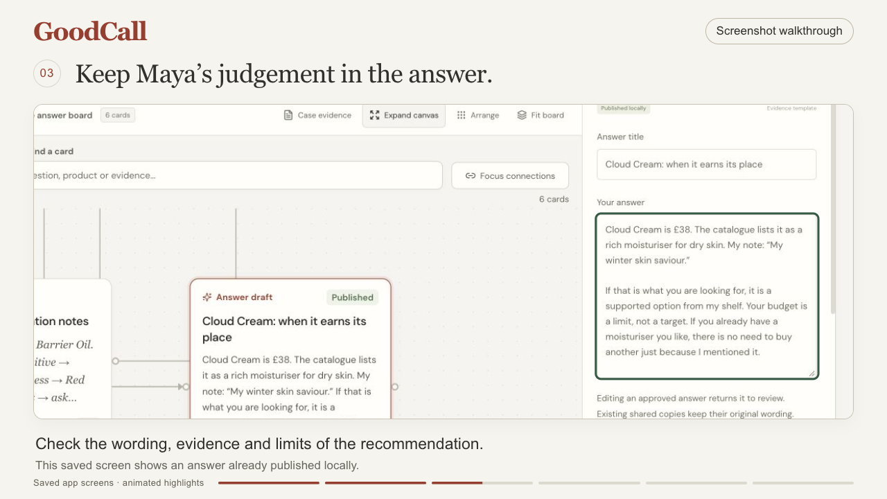](docs/demo/GoodCall-60-Second-Demo.mp4)

**[Watch the narrated demo — 60 seconds](docs/demo/GoodCall-60-Second-Demo.mp4)** · [Download the interactive walkthrough](https://github.com/MasteraSnackin/GoodCall/raw/refs/heads/main/docs/demo/GoodCall-interactive-walkthrough.zip)

*Explore Maya’s workflow through saved app screens, guided highlights and British English narration.*

## Description

GoodCall is a working local prototype for the fictional Operation Shade / Tano Creator Heist exercise. It helps Maya organise follower questions, connect supporting evidence, draft answers in her style and check missing or conflicting information before sharing an advice card. A movable canvas keeps the question, sources, decision and review state together.

The app works with browser storage and bounded local rules without credentials. Optional Claude or OpenAI assistance routes drafts and chat through a local Node proxy when configured and enabled; every answer still needs review. Tano and social inboxes are not connected. Browser speech is optional and may use the browser vendor’s online services.

## Table of Contents

- [Description](#description)
- [Features](#features)
- [Tech Stack](#tech-stack)
- [Architecture Overview](#architecture-overview)
- [Installation](#installation)
- [Usage](#usage)
- [Configuration](#configuration)
- [Screenshots / Demo](#screenshots--demo)
- [API / CLI Reference](#api--cli-reference)
- [Tests](#tests)
- [Roadmap](#roadmap)
- [Contributing](#contributing)
- [License](#license)
- [Contact / Support](#contact--support)

## Features

- **Evidence canvas:** movable question, product, note, answer, issue and case-evidence cards; saved positions and connections; card search, focused connections, zoom, minimap and expanded view.
- **Case-file library:** searchable source cards for creator context, audience profiles, content, behaviour, missing materials and the exercise brief. Page references, tables and caveats distinguish reported figures from verified findings. Adding context cards preserves existing work; linking one does not validate an answer.
- **Question management:** the 12 supplied questions, 10 products and four note/transcript summaries, plus reviewed typed or dictated questions. Keyword grouping preserves each original question; clarification retains its original source.
- **Reviewed drafting:** editable evidence-template answers in Maya’s documented style. Bounded checks flag missing records, stale product revisions, budget/context conflicts, unsupported claims and altered known prices or quotations. Explicit owned products, alternative choices and new purchases are treated separately; unclear roles or quantities need clarification. Approval and publication are separate actions.
- **Reusable decisions:** record Maya’s call, who an answer suits, when to skip and what remains unknown. Search reviewed advice and reuse a matching product/topic answer as a new, unapproved draft. See [DECISIONS.md](DECISIONS.md).
- **History and recovery:** compare refreshed wording, keep edits, and restore up to 20 earlier draft versions while retaining current evidence and requiring fresh approval. Export, validate, preview and restore private workspace backups; preserve recovery copies.
- **Evidence reports:** ten focused case-file checks with source excerpts, affected records, next actions and resolution references. Export a Markdown report. Resolving a report does not bypass answer validation.
- **Follower cards:** preview the exact public content before publishing, then save or share an encoded snapshot. Generated payloads exclude raw question records and private workspace provenance. Feedback can become a follow-up question after explicit review; it stays on the same browser and origin.
- **Chat and voice:** typed conversation, reviewed dictation, bounded navigation/drafting commands and synthetic read-aloud. Commands cannot approve or publish. Chat can explicitly add a question; it does not silently change the workspace.
- **Optional AI assistance:** choose Claude or OpenAI for source-referenced draft suggestions and chat. Existing answers remain unchanged until a suggestion is explicitly applied. Local evidence checks, stale-response checks and human approval remain in the path.
- **Maya persona and appearance:** source-backed traits and examples for drafts and voice replies; Warm studio, Beauty editorial and Case-file desk themes. See [PERSONA.md](PERSONA.md).

These checks are specific to the exercise dataset. They do not audit arbitrary uploaded documents, establish product safety or provide comprehensive semantic fact checking. The app is a single-user prototype without authentication, a shared database or an immutable audit log.

## Tech Stack

| Area | Technology |
| --- | --- |
| Interface | React 19, TypeScript 5.9, CSS, Lucide icons |
| Canvas | React Flow 12 (`@xyflow/react`) |
| Local development and build | Vite 7, Node.js 26, npm lockfile |
| Application logic | Local TypeScript rules, evidence templates and source fixtures |
| Optional AI | Node middleware in the local Vite server; Anthropic Messages API or OpenAI Responses API |
| Persistence | Browser `localStorage`, JSON backup files, URL snapshot payloads |
| Voice | Browser speech recognition and speech synthesis, where supported |
| Tests | Node test runner via `tsx`; Vitest, Testing Library and jsdom |

## Architecture Overview

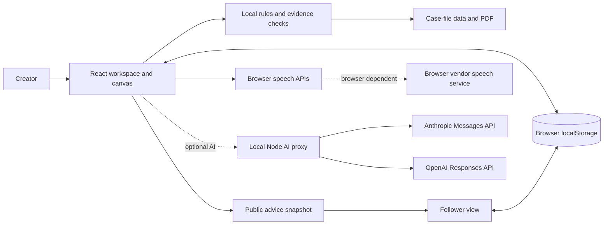

The React app owns the workspace and invokes local rules for drafting, checks and review transitions. Browser storage holds private work and local follower data; share links contain validated public snapshots. An optional local Node proxy holds AI credentials and calls the selected provider, but does not provide accounts or a remote workspace database; see [ARCHITECTURE.md](ARCHITECTURE.md).

## Installation

Use **Node.js 26**; the initial release was tested with Node 26.8.1 and npm 11.19.0. The repository includes an `.nvmrc` for `nvm` users.

1. Clone the repository and enter it:

   ```sh
   git clone https://github.com/MasteraSnackin/GoodCall.git
   cd GoodCall
   ```

2. Select Node 26 if using `nvm`, then install the locked dependencies:

   ```sh
   nvm install
   nvm use
   npm ci
   ```

3. Start the app:

   ```sh
   npm run dev
   ```

Open **http://127.0.0.1:4341/**. Use the same address consistently: `localhost` and `127.0.0.1` have separate browser storage. No database, API key or external account is required.

## Usage

### First demo

1. Choose **Demo guide → Start the demo**, or **Draft answer** on Sarah’s Cloud Cream question.
2. Inspect the question, product evidence and suggested wording. The case-file price is £38.
3. Choose **Approve answer**, then **Publish advice card**. Inspect the follower preview and choose **Publish this version**.
4. Choose **Share approved answer → Open follower view**. Save the answer or copy its link.
5. Return to the workspace and draft Jessica’s Barrier Cream answer. Its missing product information prevents approval.
6. Open **Evidence & issues**, inspect the Barrier Cream finding and choose **Export report**.

### Navigate and expand the evidence

Use **Find a card** to search the board. **Focus connections** narrows the view around a selected card; **Show all cards** or **Fit** restores it without changing saved positions. The bottom controls provide zoom, **100%**, fit, selected-card focus and a pannable minimap. **Expand canvas** gives the board more space. Close details with **Escape** or the close button; **Show card details** reopens them.

Choose **Case evidence** on the canvas to open the **Case-file evidence** library, search its sources and add individual cards or an overview. Source links open the included PDF at the relevant page. These cards describe the fictional file and retain its uncertainties; they are not live account analytics.

### Chat, voice and persona

Open **Chat with Maya** and try “Is Cloud Cream worth £38?”, followed by “My budget is £30”, or ask “What’s missing?”. Use **Enter** to send and **Shift + Enter** for a new line. Dictation stays editable until you explicitly send it. **Read aloud** speaks one reply; **Speak replies** applies to new replies. The latest 60 messages remain on this device until cleared. Damaged stored chat is copied before replacement; failed preservation blocks the write and exposes a retry action. Clearing active history leaves preserved recovery copies intact.

In **Voice**, review the transcript before choosing **Run command** or **Use as question**. Try “Show reports”, “Explain this card”, “What is your approach?” or “Draft an answer for Sarah”. Named drafting commands require an exact follower match. The selected browser voice is synthetic; the source PDF provides a transcript and QR placeholder, not a usable Maya recording. The app stores no audio.

### Optional live AI

Choose **Set up AI** in the header. Select **Claude (Anthropic)**, enter an Anthropic API key and choose **Connect and enable AI**. Claude Haiku 4.5 (`claude-haiku-4-5-20251001`) is the default for a fresh connection. OpenAI remains available as an alternative with its own API key. An OpenAI key cannot connect to Claude.

Connecting checks access to the selected model; it does not prove that the account can generate an answer. A connected session can change its model without re-entering the key. Switching provider requires that provider's key and replaces the active connection only after the check succeeds. Failed checks preserve the existing connection. **Use live AI for new answers and chat** controls whether new requests use the provider or local templates.

Live requests send the current question, supporting catalogue/case-file records, selected context and a short chat history to the selected provider. Common follower-handle patterns are stripped, but personal-data redaction is incomplete. Review what you enter. Generation uses your API account. The earlier OpenAI live request on 20 September 2026 returned HTTP 429 without saving or overwriting an answer; a later live Claude check produced a sourced, unapproved clarification draft. Two chat checks exposed context/wording holds; see [TEST-REPORT.md](TEST-REPORT.md) for their repair and acceptance status. A successful draft is not a general answer-quality guarantee.

For an existing answer, **Suggest with AI** opens a comparison before replacement. Applying it returns the answer to draft. Errors or cancellation preserve current wording and do not silently switch providers or substitute a local answer. Provider errors are shown without forwarding private response details. Disconnecting clears the active server credential and cancels pending requests; environment configuration can return after a server restart.

**Keys entered in the form last only for the current server session.** A server restart forgets them. To configure your own persistent local setup, use the server environment variables below; the app does not automatically save form keys to disk or browser storage.

### Protect work and review publication

**Regenerate from evidence** compares existing wording with a fresh suggestion. Keep the wording while refreshing evidence, or accept the suggestion; both require review. **Saved draft versions** restores wording with current evidence, without restoring old approval.

Use **Backup & restore** to download a private JSON backup or preview a replacement. Backups include workspace questions, evidence records, drafts, history, reports and layout. Chat, follower saves, feedback and appearance preferences are separate. A publication preview highlights some possible contact details, but a human must still check the complete public wording. Preview and publication use the same snapshot format/size checks, and publication becomes visible only after the proposed workspace is saved successfully.

Follower feedback offers **That helped**, **Too expensive**, **I already own something similar** and **Still unsure**. Review a clarification in **Follower feedback** before adding it as a question. The prototype does not send feedback between devices or message a follower.

### Build and preview

```sh
npm run build
npm run preview
```

Stop the development server before previewing; both use port 4341 with strict port checking. `build` writes `dist/`. The included servers bind to the local machine and are not internet deployments. A shared snapshot only opens on a device that can access the app’s origin. Editing or withdrawing the original does not revoke an existing link.

## Configuration

No environment variables are required for local templates. The optional proxy accepts `AI_PROVIDER=anthropic` with `ANTHROPIC_API_KEY` and `ANTHROPIC_MODEL`, or `AI_PROVIDER=openai` with `OPENAI_API_KEY` and `OPENAI_MODEL`. The model defaults are `claude-haiku-4-5-20251001` and `gpt-4.1-mini` respectively. Account access and generation capability need verification.

Use the server environment or a private `.env.local` file. The repository ignores populated environment files and includes a blank `.env.example`. Restrict any populated file to your user account; never prefix a key with `VITE_`, place it in client source or commit it. The selected provider only receives its matching credential. Without an explicit selection, an Anthropic environment key takes precedence, an existing OpenAI-only configuration remains supported, and an unconfigured app defaults to Claude.

Alternatively, enter a key through **AI connection** for the current session. It is held in the local server process, not browser storage or workspace backups. The proxy runs in both `npm run dev` and `npm run preview`; a static `dist/` deployment does not contain it.

| Setting | Location | Behaviour |
| --- | --- | --- |
| Node version | `.nvmrc` | Node 26 development baseline |
| Server address | `package.json` scripts | `127.0.0.1:4341`, strict port |
| AI provider | `AI_PROVIDER` | `anthropic` or `openai`; fresh setup defaults to Claude |
| Claude key/model | `ANTHROPIC_API_KEY`, `ANTHROPIC_MODEL` | Server-only Claude configuration |
| OpenAI key/model | `OPENAI_API_KEY`, `OPENAI_MODEL` | Server-only alternative; no key required for local mode |
| Build | `vite.config.ts`, `tsconfig.json` | React plugin and strict TypeScript checking |
| UI tests | `vitest.config.ts` | jsdom, `tests/**/*.test.tsx`, shared setup |
| Main workspace | `maya-answer-canvas-v1` | Local workspace, plus recovery and pre-restore copies |
| Other local stores | `maya-chat-v1`, `maya-saved-advice-v1`, `goodcall-follower-feedback-v1`, `maya-theme` | Separate chat, saved advice, feedback and appearance |
| Workspace backup limit | `src/lib/workspaceValidation.ts` | 5,000,000 bytes; structure and record references are validated |

The legacy `maya-*` storage names preserve existing data after the GoodCall rename. Clearing site data removes local records. The interface loads fonts from Google Fonts; optional browser speech can also depend on a network service.

## Screenshots / Demo

Run the local demo using the steps above. No public live deployment is supplied.

### 60-second walkthrough

Follow Maya from audience questions and connected evidence to answer review, reusable follower advice, chat and voice controls, and missing-material reports.

| Version | Open or download |
| --- | --- |
| **Narrated video** | [60-second MP4](docs/demo/GoodCall-60-Second-Demo.mp4), with a synthetic British English female voice-over and optional English captions |
| **Silent animation** | [60-second GIF](docs/demo/GoodCall-60-Second-Demo.gif), with zooms and highlights |
| **Interactive walkthrough** | [Download ZIP](https://github.com/MasteraSnackin/GoodCall/raw/refs/heads/main/docs/demo/GoodCall-interactive-walkthrough.zip), extract it and open the HTML in a browser; six screens and 18 clickable hotspots work offline |
| **Text and captions** | [Narration script](docs/demo/GoodCall-narration.txt) · [SRT captions](docs/demo/GoodCall-captions.srt) |

These walkthroughs animate or explore saved screenshots. They do not operate the live app or demonstrate microphone, speaker or provider responses. The video’s voice-over is a separately generated narrator. See the [demo guide](docs/demo/README.md) for all formats and controls.

### Screenshot gallery

**Answer review**

Review an answer alongside its supporting evidence.

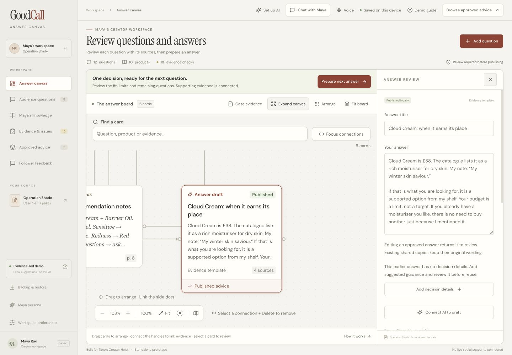

**Desktop canvas**

Connect questions, product facts, notes and answers on a movable board.

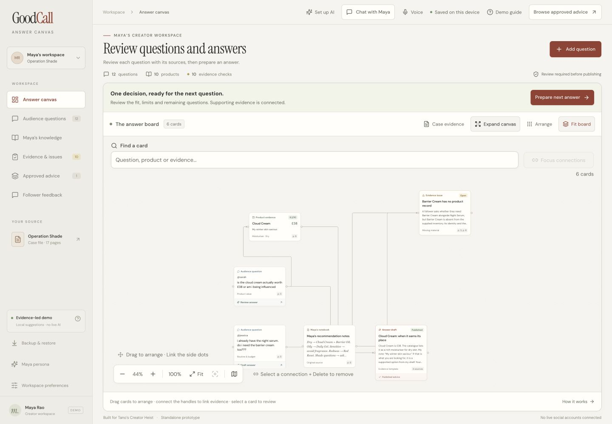

**Audience questions**

Browse the original follower questions by topic, with source links and actions for drafting or review.

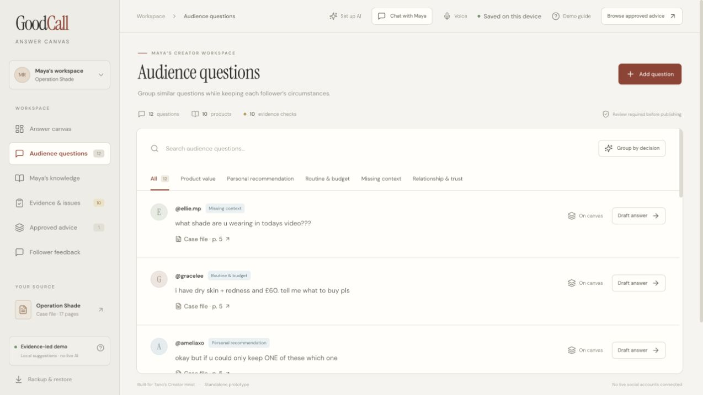

**Products and Maya’s notes**

Compare the case-file products, prices, ratings and Maya’s quoted judgement.

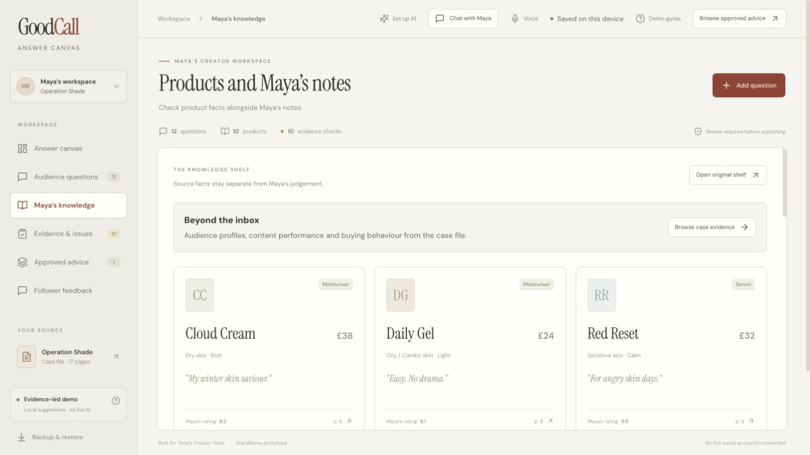

**Missing materials and inconsistencies**

See open findings, missing materials and the questions that need more evidence.

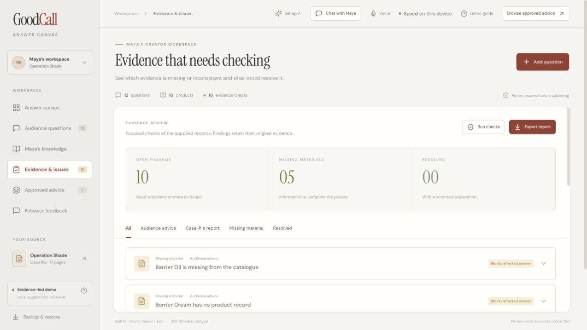

**Case-file evidence library**

Search 18 source cards covering Maya, her audience, content, behaviour and unresolved case details.

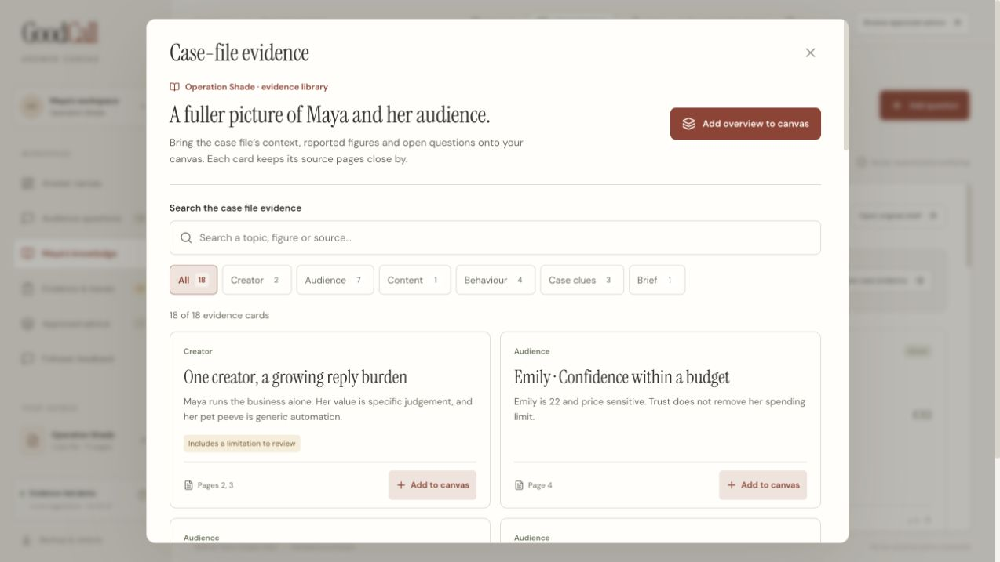

**Follower-facing advice**

A locally reviewed answer in the follower reading view, labelled as part of the exercise demo.

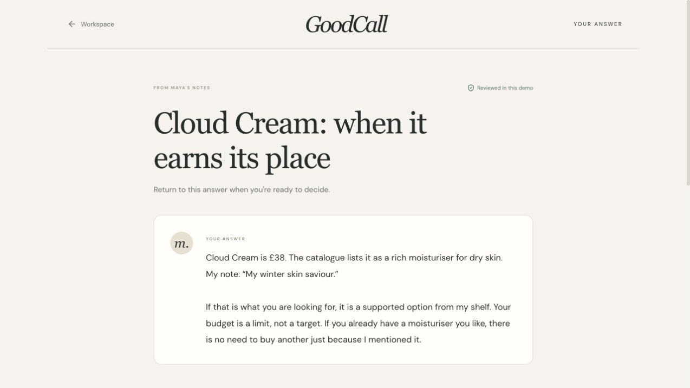

**Phone-width answer review**

Read and review the answer in the compact inspector.

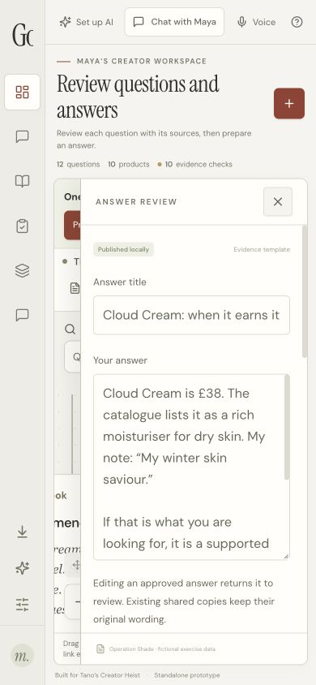

**Phone-width evidence library**

Browse and search case-file evidence on a phone-width screen.

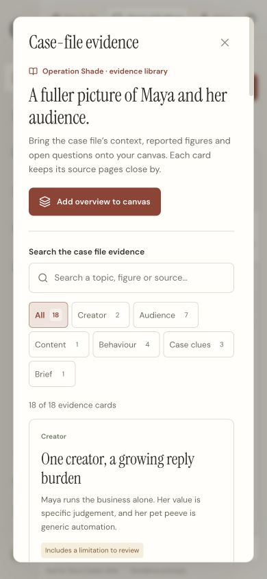

These captures document the inspected local interface. They do not establish physical microphone/speaker operation or live provider access; consult the [final review report](docs/review/TASK-RESULTS.md) for interaction coverage.

The current audit also includes short recordings of a reproduced dialog defect and its repair. They show actual browser interactions with fictional, unsaved test text:

- [Before: clicking inside the dialog loses the form](docs/review/current-audit/dialog-before.mp4)
- [After: the same click preserves the form](docs/review/current-audit/dialog-after.mp4)
- [Current seven-step audit and fresh screenshots](docs/review/AUDIT.md)

The five-slide presentation includes a 60-second pitch with speaker notes:

- [View the pitch as a PDF](docs/pitch/GoodCall-60-Second-Pitch.pdf)
- [Download the editable PowerPoint](docs/pitch/GoodCall-60-Second-Pitch.pptx)

The visual direction uses cream paper, charcoal and muted rust, with distinct question, product, note and issue cards. Physical browser, phone, pointer and audio acceptance remain separate from automated testing.

## API / CLI Reference

There is no public account/workspace API or custom CLI. The available npm commands are:

| Command | Purpose |
| --- | --- |
| `npm run dev` | Start the local Vite development server |
| `npm run build` | Check TypeScript and generate `dist/` |
| `npm run preview` | Serve the production build locally |
| `npm test` | Run Node logic tests, then simulated-interface tests |

The browser route `#/advice/<snapshot>` opens a validated advice snapshot. It is a client-side route, not a server endpoint or signed publication record.

The local Vite server also mounts these AI endpoints:

| Method and route | Purpose |
| --- | --- |
| `GET /api/ai/status` | Return configured state, provider, model and credential source; never the key |
| `POST /api/ai/connect` | Check the selected provider/key/model and hold the credential for this server session |
| `POST /api/ai/model` | Check and change the model using the existing server credential; keep the previous model if the check fails |
| `POST /api/ai/disconnect` | Clear the active credential and cancel pending operations |
| `POST /api/ai/answer` | Validate a draft/chat request and return a checked AI suggestion |

Read the local status without sending a model request:

```sh
curl http://127.0.0.1:4341/api/ai/status
```

POST requests require a matching local origin, JSON and `X-GoodCall-Client: canvas`; use the app controls. This is a local development/preview interface without user authentication, not a public service contract.

## Tests

```sh
npm test
npm run build
```

Logic tests use Node’s test runner through `tsx`; UI tests use Vitest, Testing Library and jsdom. Coverage includes evidence and budget gates, source changes, review transitions, private-source exclusion, snapshot validation, local feedback, chat and mocked speech lifecycles, draft history, recovery, canvas navigation and creator/follower workflows.

See [TEST-REPORT.md](TEST-REPORT.md) for dated results and [USABILITY-CHECKS.md](USABILITY-CHECKS.md) for the six audience scenarios and device checks. Graph integration tests use a callback adapter in place of the real renderer. Simulated tests alone do not establish layout, real dragging, browser permissions, microphone capture, audible playback, clipboard or downloads. The initial browser-policy block was historical; desktop and phone-width browser inspection is now available, with its actual coverage recorded separately. Physical voice and live provider verification remain unproven by screenshots or mocked tests.

## Roadmap

Possible next steps, not current capabilities:

- Add editable, persisted product roles beyond the current derived ownership, comparison and purchase checks.
- Extend browser and phone acceptance evidence, including physical speech and storage-denial paths.
- Evaluate an authenticated backend, revocable public records and cross-device feedback before using real private messages.
- Extend live Claude checks to response completeness and broader questions; evaluate Tano/social integrations when access is supplied.
- Measure performance with larger workspaces and consider splitting the initial bundle.

## Contributing

Open an [issue](https://github.com/MasteraSnackin/GoodCall/issues) for a reproducible defect or a scoped proposal, then submit a [pull request](https://github.com/MasteraSnackin/GoodCall/pulls) with the change and relevant validation. Run `npm test` and `npm run build` before proposing code changes.

Preserve original follower context, source references and explicit review steps. Keep fictional case-file material separate from verified external facts. Include meaningful regression tests for changed logic, and state which browser/device checks were actually performed. Do not commit credentials, private workspace backups, dependencies or build output.

## License

No project licence has been selected and no `LICENSE` file is included. This repository does not grant a general licence to use, modify or redistribute the project or the supplied exercise materials. Contact the maintainer about permission; dependencies retain their respective licences.

## Contact / Support

Maintainer: [MasteraSnackin](https://github.com/MasteraSnackin). Use [GitHub issues](https://github.com/MasteraSnackin/GoodCall/issues) for support and bug reports. No separate support email or website is published here.
