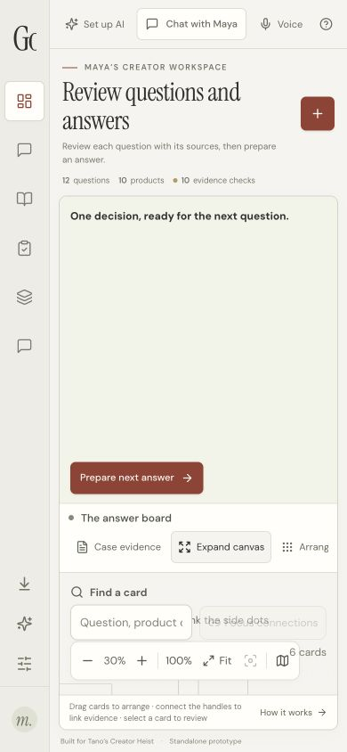
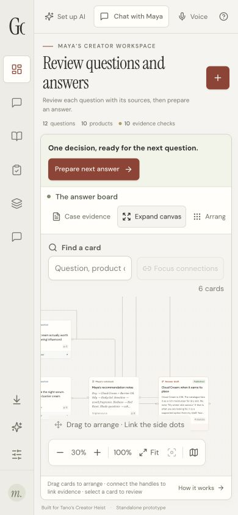
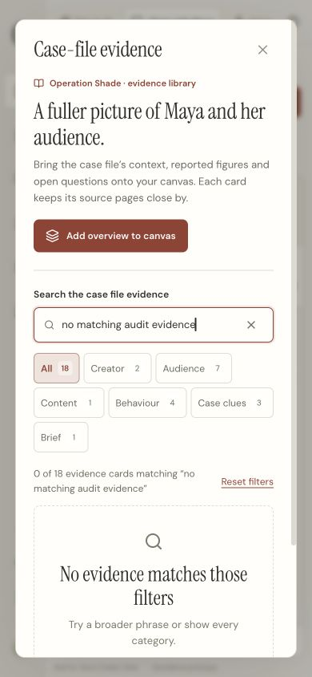

# GoodCall visual and functional audit

Reviewed 20 September 2026. Scope: the local React/Vite prototype at `http://127.0.0.1:4341/`, with the integrated case-evidence, design and optional AI changes. The original task templates and synced sources were left untouched.

## Result and scorecard

**Verified & Polished for the tested local prototype scope.** No unresolved critical defect was found in the inspected flows after repair. These are reviewer judgements against the criteria below, not measured usability scores, WCAG certification or production approval.

| Category | Before repair | After repair | Evidence and remaining limitation |
| --- | --- | --- | --- |
| Visual | 7/10 | 9/10 | Phone layout, canvas viewport and three low-contrast labels corrected; readable desktop/phone inspectors. The full-board overview still requires zoom or an inspector for detailed reading. |
| Functional | 7/10 | 9/10 | Publication, chat preservation, reuse matching and dialog focus regressions repaired; 288 tests and production build pass. Physical dragging, clipboard, downloads and audio need device acceptance. |
| Trust | 7/10 | 9/10 | Publication waits for successful persistence; damaged chat is preserved; sources, missing evidence and local/AI modes remain explicit. A real provider 429 was handled without overwriting an answer; successful generation and real audience comprehension remain unverified. |

## Captured audit steps

1. **Open the desktop canvas at 1440 × 1000.** The app renders; navigation, source types, review actions and local/AI state are visible. Clicked Fit and inspected the board overview. The overview deliberately compresses long card text; the inspector is the reading surface.

   

2. **Open Review answer.** The focused answer and inspector show the editable judgement, supporting sources and review state. Existing wording remains present. The final capture also shows the optional AI connection action.

   

3. **Inspect the answer at 390 × 844.** The inspector fits the viewport with readable fields and a close control. Document width and scroll width both measured 390 px: no page-level horizontal overflow in this state.

   

4. **Close the inspector and inspect the phone canvas.** The first capture exposed a 345 px introductory block caused by a desktop flex basis becoming height. After correction it measures 86 px. The board container grows from approximately 136.6 to 395.6 px; the graph viewport is approximately 293.6 px high and ends at the board boundary. The first graph-height-only correction collapsed the graph; the corrected position and height rules were then inspected successfully.

   | Before | After |
   | --- | --- |
   |  |  |

5. **Open Case evidence on the phone layout.** The library displays 18 records, category controls, source references and caveats.

   

6. **Search for absent evidence and recover.** Entered “no matching audit evidence”; the library shows 0 of 18 with a clear recovery action. Show all evidence restores 18 of 18. Escape closes the dialog.

   

7. **Check keyboard dialog exit.** Opened Case evidence with Enter and closed it with Escape. Before repair, focus ended on `BODY`; afterwards it returned to the `BUTTON` labelled “Case evidence”, with no open dialog. A DOM regression also covers the shared modal opener restoration.

These are saved, inspected screenshots and actual UI interactions. No interaction video was recorded. Screenshots do not prove speech, touch or provider behaviour.

## Visual wins

- Cream paper, charcoal and muted rust provide a coherent case-file identity; distinct source colours aid scanning without replacing labels.
- Question, evidence, answer and review state stay close together; the inspector provides a readable alternative to the overview.
- The sidebar groups creator work, evidence and follower outputs clearly. The evidence library has useful search, categories, counts and a recoverable empty state.
- The phone repair restores working space without changing existing card positions or the chosen visual direction.

## Critical findings and completed repairs

| Finding | Repair | Proof |
| --- | --- | --- |
| Phone introduction consumes most of the board space | Reset the review introduction's flex basis in the narrow column layout | Before/after captures and DOM dimensions above |
| React Flow's inline root styles defeat the intended graph inset | Explicitly pin the root below controls and let the inset determine height | Graph ends at board boundary after repair |
| Issue, placeholder and result-count colours are too faint at normal text sizes | Darker colours within the existing palette | Source colour calculation and rendered inspection; see DESIGN-LEAD |
| Closing a modal loses its keyboard origin | Capture the mounted dialog/opener; close and restore connected opener on cleanup | Actual Enter/Escape check plus DOM regression |
| Approved advice can be marked published before an oversized link or failed save is detected | Preflight the exact snapshot and save before returning published state | Four publication rule tests and three interface regressions |
| Invalid chat can be overwritten by automatic saving | Preserve and verify exact original storage text before replacing it | 21 chat-storage tests |
| Delimiter-based product-set keys collide | Encode canonical product arrays with JSON; index question lookup locally | Seven new reuse regressions and paired benchmark |

Root causes and test details: [DEBUG.md](DEBUG.md). Preservation and recovery contract: [ERROR-HANDLING.md](ERROR-HANDLING.md).

## Interaction and trust states

| State or criterion | Finding |
| --- | --- |
| Loading | Local operations are synchronous; AI operations expose pending, cancel and retry states. These paths have simulated HTTP/UI tests. A skeleton is not useful for every local action. |
| Empty | Evidence-search empty state and recovery were exercised in the real browser. |
| Error | Publication size/storage errors retain review state; chat failures retain the original; AI failures retain existing wording and require explicit retry. Fault injection was automated, not performed against the user's real storage. |
| Success | Publication success follows successful saving. Local action feedback exists; no universal sub-100 ms latency claim was measured. |
| Optimistic updates | Ordinary local editing updates immediately. Publishing deliberately waits for persistence because reporting success early caused a trust defect. |
| Dialog intent | Publication preview, restore and AI setup benefit from explicit dialogs; evidence browsing also uses a focused library dialog. Focus return now works in the tested shared dialog. |
| Source integrity | Case-file statements retain page references and caveats. Linking a source or resolving a report does not automatically validate an answer. |
| AI boundary | An optional local OpenAI proxy is implemented. A user-authorised live OpenAI request was rejected with HTTP 429 after connection. The UI displayed a rate-limit/quota error without saving or overwriting an answer. Successful generation, Tano and social-account connections remain unverified. |

## Scope adaptations and follow-up

The templates name Next.js 16, Antigravity, Tailwind, Framer Motion, Modal, glassmorphism and kinetic typography. GoodCall uses React/Vite, Codex, CSS and a local Node proxy. The review applied their underlying documentation, design, debugging and reliability tasks to this implementation. No framework migration, decorative animation or cloud deployment was introduced solely to match an example. The supplied visual trends are preferences, not external standards.

Remaining acceptance: physical microphone and speaker operation, real touch-device use, a complete keyboard/screen-reader audit, pointer dragging, clipboard/download behaviour, representative audience sessions and successful live AI generation once the account limit is resolved. The non-blocking bundle advisory remains: final JavaScript is 655.93 kB minified / 206.41 kB gzip. See [PERFORMANCE.md](PERFORMANCE.md) for a measured optimisation and bounded next steps.

Applicable accessibility guidance consulted: [WCAG contrast minimum](https://www.w3.org/WAI/WCAG22/Understanding/contrast-minimum.html), [target size minimum](https://www.w3.org/WAI/WCAG22/Understanding/target-size-minimum.html) and [reflow](https://www.w3.org/WAI/WCAG22/Understanding/reflow.html). This scoped review does not establish conformance to all criteria.
