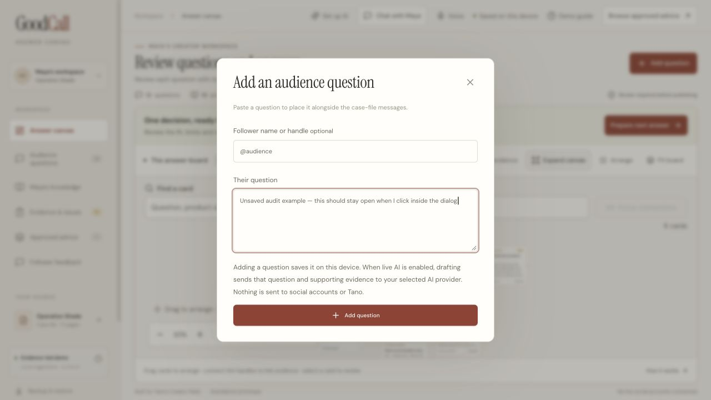
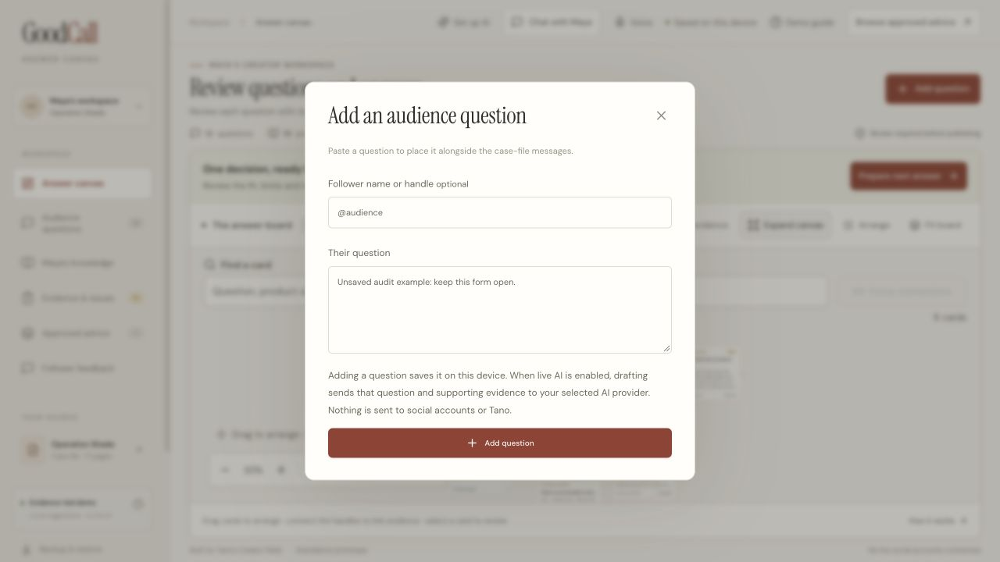
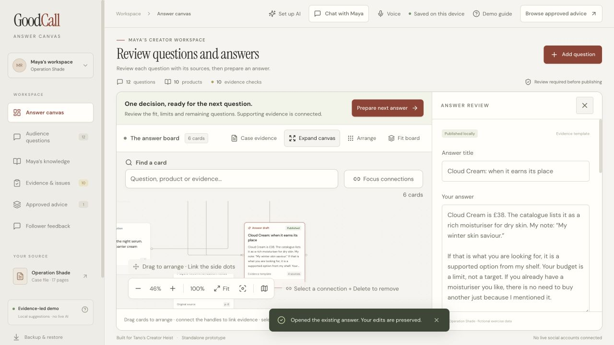
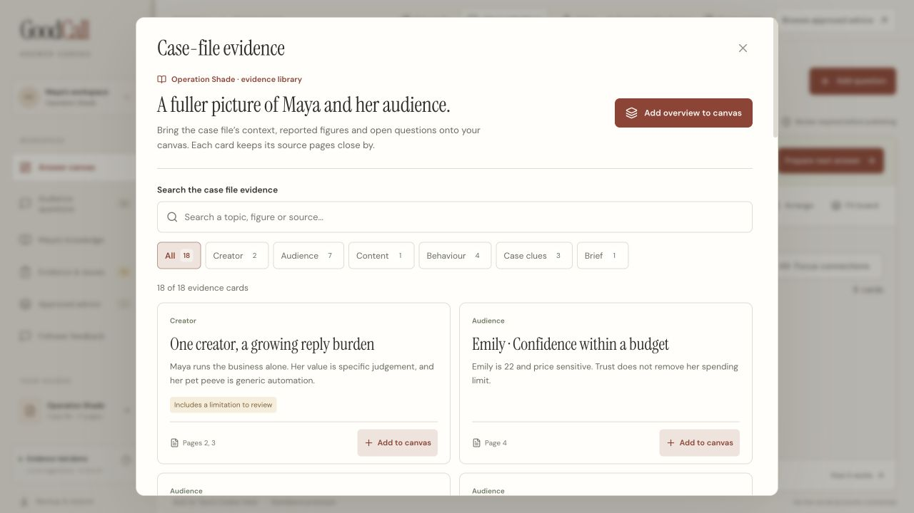
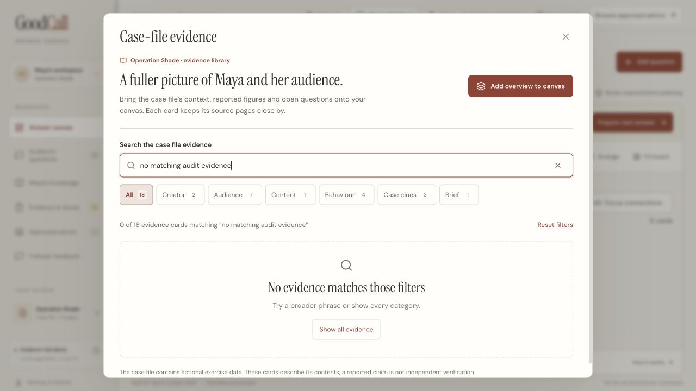
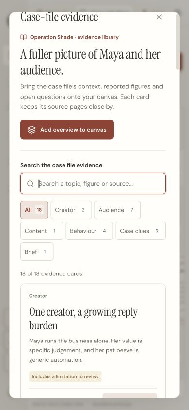
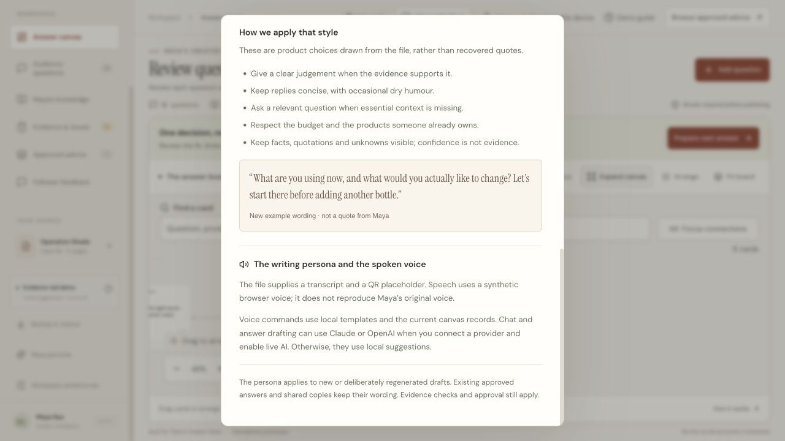

# GoodCall visual and functional audit

Current nine-file review, 20 September 2026. Scope: the existing React/Vite local prototype, its current Claude/OpenAI integration and the seven browser steps below. Original attachments and synced sources were not modified. The [initial audit](AUDIT-INITIAL.md) preserves the earlier mobile, contrast, storage and publication repair evidence; its screenshots and counts are historical.

## Result and scorecard

The current inspection found and repaired an accidental dialog dismissal and stale persona/provider copy. Independent logic review also reproduced budget-role and arithmetic defects; their regression coverage and final combined result are in [TEST-REPORT.md](../../TEST-REPORT.md). A separate live Claude check produced a sourced draft, and the final factual chat retest succeeded with a citation. The requested quotation was omitted; that content-quality limit remains explicit in the test report.

| Category | Reviewer judgement | Evidence and limit |
| --- | --- | --- |
| Visual | 9/10 for the inspected states | Consistent Warm studio palette, readable answer inspector, labelled evidence, clear empty-state recovery and a phone-width library with no page overflow. The full board requires zoom/inspection to read long cards. |
| Functional | 9/10 for the inspected local flows | The padding defect is fixed in real interaction; outside clicks and focus return still work. Budget/context corrections have regression coverage. The final live factual chat retest succeeded, but omitted a requested quotation; human wording review remains necessary. |
| Trust | 9/10 for the inspected states | Evidence, unknowns, local saving and review remain explicit. Provider copy now matches the implementation. Missing evidence continues to block approval; there is no automatic publication. |

These scores are reviewer judgements, not measured usability, a WCAG certification or production approval. They do not establish the template's three-second comprehension target, which needs participant observation.

## Fresh captured journey

1. **Start an unsaved question and click inside its padding — defect reproduced.** At 1280 × 720, entered fictional test text and clicked at x=399, y=357 inside a dialog bounded by x=390–890. The dialog closed; reopening showed an empty form. No question was submitted or saved. Health: failed before repair.

   

   [Actual before recording, 5.78 seconds](current-audit/dialog-before.mp4). This is a live browser capture, not a screenshot montage.

2. **Repeat after the bounds repair — passed.** Entered the same test wording and clicked the same interior coordinate. The dialog stayed open and the text remained. Clicking x=365, y=357 outside the dialog then closed it and returned focus to Add question; zero dialogs remained open. Health: repaired and checked.

   

   [Actual after recording, 5.59 seconds](current-audit/dialog-after.mp4). Both clips are silent and contain no added cursor or reconstructed screen; [recording provenance](current-audit/RECORDINGS.md) describes the original capture timing and checks.

3. **Open an existing answer for review — passed.** Review answer opens the readable inspector and preserves the existing published wording. Sources, review state, version history and an explicit AI connection action remain available. No answer was edited, approved or published during this inspection. Health: working.

   

4. **Browse case evidence — passed.** Opened the library and inspected 18 source cards, categories, page references and limitation labels. One instrumented click reached the second animation frame with the dialog open in **87.2 ms** on this machine. This is a single local sample and an animation-frame proxy, not a universal latency or physical presentation guarantee. The one-shot listener removed itself; [raw result](current-audit/feedback-timing.json). Health: working.

   

5. **Search for absent evidence and recover — passed.** “no matching audit evidence” produced 0 of 18, a plain explanation and Show all evidence. That action restored all 18 records. Health: working empty and recovery states.

   

6. **Check the phone breakpoint and keyboard exit — passed for this state.** At 390 × 844, document width and scroll width were both 390 px; the evidence dialog was 352 px wide. Category controls wrapped and source cards remained readable. Escape closed the dialog and returned focus to Case evidence. The temporary viewport override was reset. Health: working in responsive simulation; physical touch remains untested.

   

7. **Read the persona/provider explanation — passed.** The persona now distinguishes local voice commands, optional Claude/OpenAI chat and drafting, and synthetic browser speech. The previous unconditional claim that live AI was unavailable was removed. Health: corrected and checked.

   

The temporary audit tab was closed. The inspection left no new question, publication, credential, provider request or permanent viewport override. Existing case-file records were the only saved content shown in these captures.

## Findings, repairs and remaining checks

| Finding | Repair and evidence |
| --- | --- |
| Shared dialogs treated interior padding as a backdrop | Check pointer coordinates against the dialog rectangle before closing. Two DOM regressions cover preservation and genuine backdrop dismissal; the before/after clips verify the real interaction. |
| Persona claimed no live conversational AI existed | Explain local commands and optional provider use separately; preserve the synthetic-voice distinction. Fresh rendered capture above. |
| Every evidence-linked product was counted as new spending | Derive explicit owned, purchase and alternative roles; preserve all evidence links and ask when roles or quantities are unclear. See the budget regression cases in [DEBUG.md](DEBUG.md). |
| Explicit option selection could inherit another alternative's remainder | Validate selected spending/remainders against the selected purchase while allowing other linked prices as factual evidence. Independent review and regression details are recorded in the debug/test reports. |
| Live chat exposed stale context and a negated comparison false hold | Positive/negated comparison intent and standalone conversation context were corrected. The live factual retest passed its price/label/finish/citation checks; consult the test report for the omitted-quote limitation. Evidence gates are not disabled to make a reply pass. |

Loading, cancellation, error and success states are covered in the provider/storage workflow tests. This audit exercised local success, empty/recovery and accidental-dismissal states directly. Fault-injection tests use isolated fixtures; the user's storage was not corrupted to provoke failures. Publication success remains dependent on successful persistence.

## Template adaptations and boundaries

The briefs name Next.js, Tailwind, Framer Motion, Modal and decorative styles. The review applied their documentation, design, debugging and reliability requirements to GoodCall's existing React/Vite/CSS app and local Node endpoints. An optional clarification was offered; no instruction to migrate the stack or change the established visual style was received. No new cloud infrastructure was deployed.

A three-second information-hierarchy claim needs representative participants. Sub-100 ms feedback was sampled for one action only. Physical microphone/speaker operation, touch/dragging, full keyboard/screen-reader coverage, clipboard/download acceptance and audience usability remain separate checks. Tano/social integration is absent. The bundle-size advisory remains; [PERFORMANCE.md](PERFORMANCE.md) distinguishes measured retrieval improvements from future profiling work.
